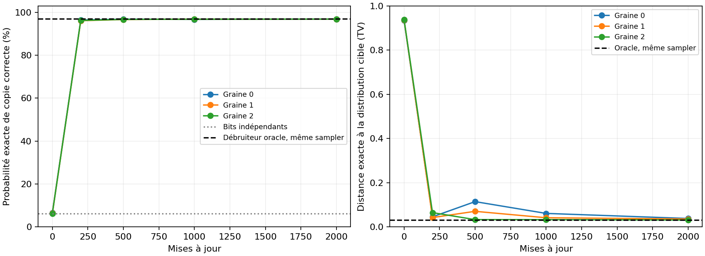
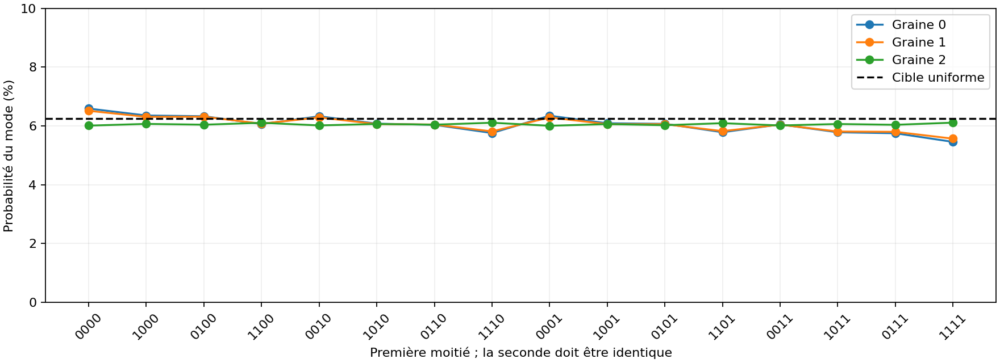

# Preuve de fonctionnement : apprendre une distribution connue

Verdict des critères fixés avant entraînement : RÉUSSITE sur toutes les graines.

Cette expérience vérifie une propriété précise : un MDLM entraîné depuis zéro apprend-il les dépendances d’une distribution simple et son sampler les reproduit-il ? Les probabilités sont calculées exactement par énumération, pas déduites de quelques beaux exemples.

## Tâche et contrôle

On tire quatre bits indépendants et équitables, puis on les répète : 0101 → 01010101. Les 16 séquences valides doivent toutes avoir une probabilité de 1/16. Des bits indépendants ont les mêmes marginales, mais ne respectent la copie que dans 1/16 = 6,25 % des générations. Générer toujours 00000000 respecte la règle tout en échouant au test de distribution et de diversité.

Le Transformer existant est réutilisé sans modifier son code de réseau, sa loss MDLM ou son sampler ancestral. Il possède 100,546 paramètres, reçoit des masques absorbants et est entraîné pendant 2000 mises à jour, avec un batch de 64, trois graines et le CPU JAX. La largeur, le vocabulaire et la longueur sont adaptés à la tâche. Aucun oracle ne fournit de prédictions au réseau pendant l’entraînement ou la génération.

## Résultats exacts à 64 étapes

| Modèle | Copie correcte | Distance TV ↓ | NLL exacte, bits/car. ↓ | Pas entraînement seuls |
| --- | --- | --- | --- | --- |
| Bits indépendants | 6,25 % | 0,9375 | 1,0000 | — |
| Distribution cible | 100 % | 0 | 0,5000 | — |
| Débruiteur oracle | 96.91 % | 0.0309 | 0.5057 | — |
| MDLM, graine 0 | 96.86 % | 0.0383 | 0.5059 | 13.7 s |
| MDLM, graine 1 | 96.86 % | 0.0360 | 0.5059 | 15.4 s |
| MDLM, graine 2 | 96.87 % | 0.0313 | 0.5057 | 14.9 s |

TV = ½ Σx |pmodèle(x) − pcible(x)|, en sommant les 256 sorties binaires, y compris les séquences invalides. Les chiffres NLL sont ici de vraies vraisemblances, contrairement aux bornes NELBO du précédent benchmark textuel. L’entropie de la cible vaut 4 bits par séquence de 8 caractères, soit 0,5 bit/caractère.



## Diversité et vérification du sampler réel



| Graine | Valides / 4096 tirages | Modes observés / 16 | TV tirages / chaîne exacte | Reconstruction déterminable |
| --- | --- | --- | --- | --- |
| 0 | 96.92 % | 16 | 0.0299 | 100.00 % |
| 1 | 96.39 % | 16 | 0.0389 | 100.00 % |
| 2 | 96.66 % | 16 | 0.0269 | 100.00 % |

Les tirages proviennent de la fonction diffusion_sample déjà utilisée dans le projet, sans guidage ni correction de la copie. Leur distribution empirique est comparée au calcul exact indépendant. La reconstruction déterminable couvre exhaustivement les états bruités cohérents dont le bit partenaire est visible ; la réponse attendue est alors connue.

```text
Premiers tirages de la graine 0, sans sélection :
11101110
10001000
10101010
11101110
10001000
11011101
00100011
01000100
01000100
01000100
11101110
00010001
10001000
10111010
01110111
10011001
```

## Pourquoi l’oracle lui-même reste sous 100 %

En génération parallèle, les deux bits d’une paire peuvent être révélés à la même étape. S’ils étaient tous deux masqués, même un débruiteur parfait prédit deux marginales équitables ; elles sont tirées indépendamment et peuvent diverger. Pour S étapes linéaires, la probabilité exacte de validité de l’oracle est (1 − 1/(2S))⁴. Ce résidu vient du sampler fini ; il diminue lorsque S augmente.

| Étapes | Oracle | Graine 0 | Graine 1 | Graine 2 |
| --- | --- | --- | --- | --- |
| 4 | 58.62 % | 58.61 % | 58.61 % | 58.59 % |
| 16 | 88.07 % | 88.04 % | 88.04 % | 88.03 % |
| 64 | 96.91 % | 96.86 % | 96.86 % | 96.87 % |
| 256 | 99.22 % | 99.17 % | 99.17 % | 99.17 % |

## Critères fixés et portée de la preuve

```text
{
  "valid_probability_min": 0.9,
  "total_variation_max": 0.1,
  "exact_nll_bits_per_character_max": 0.56,
  "min_valid_mode_probability_min": 0.025,
  "empirical_vs_exact_tv_max": 0.06
}
```

Chaque graine doit passer tous les seuils au dernier checkpoint prévu. Les critères combinent validité, fidélité de distribution, vraisemblance exacte, probabilité minimale de chaque mode et accord sampler/énumération. Le protocole et les empreintes des sources sont conservés avec les résultats.

C’est une preuve expérimentale de fonctionnement sur une tâche contrôlée. Les 16 modes sont présents dans la distribution d’entraînement : cela ne démontre pas une généralisation à de nouveaux modes, une compréhension du langage ou une reproduction du papier MDLM. Le précédent benchmark Shakespeare conserve ses limites. Le calcul dit exact énumère toute la chaîne en arithmétique flottante ; la conservation de masse est vérifiée à 10⁻⁸ près.

## Reproduire et auditer

```text
JAX_PLATFORMS=cpu python3 proof.py run
JAX_PLATFORMS=cpu python3 check.py --output results/proof/tests.json
# Pour repartir de zéro sans écraser les résultats :
JAX_PLATFORMS=cpu python3 proof.py run --output results/proof_reproduction
```

[Résultats complets et critères](summary.json)

[Protocole fixé avant entraînement](protocol.json)

[Empreintes des sources](source_manifest.json)

Tests logiciels et mathématiques exécutés : 42. Réussite globale : True. Les tests spécifiques confrontent notamment l’énumération à la formule analytique de l’oracle et détectent l’effondrement sur un seul mode.

[Preuve d’exécution des tests](tests.json)

[Code de l’énumération exacte](../../nanodiff/exact_copy.py)
