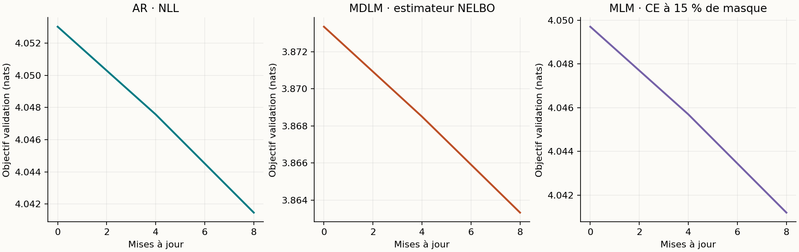
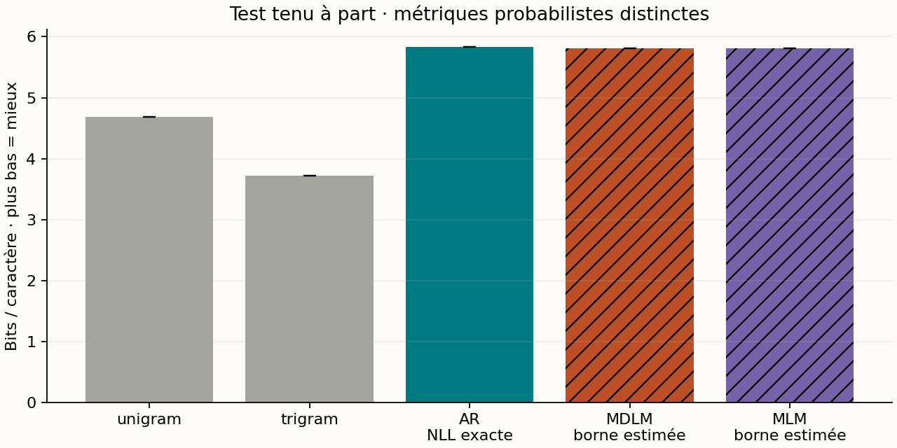
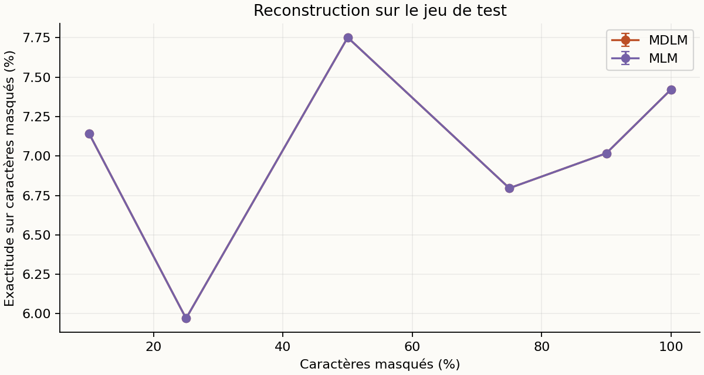
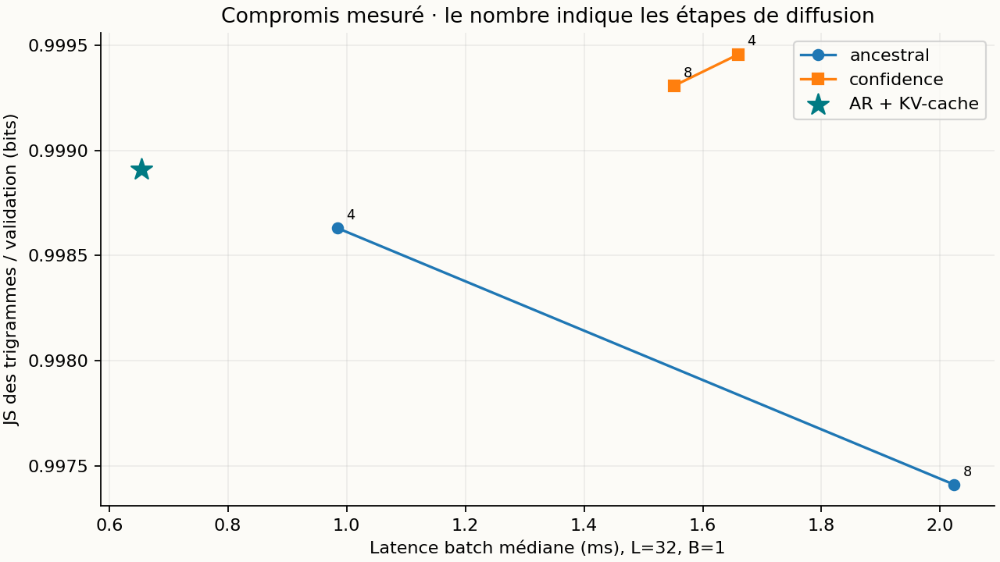

# Diffusion discrète en JAX : une étude reproductible à petit budget

Rapport expérimental · Tiny Shakespeare · entraînements et mesures locaux · 13 septembre 2026

SCÉNARIO SMOKE : contrôle fonctionnel de la chaîne complète. Ce budget minuscule ne permet aucune conclusion sur la qualité des modèles ; ses temps ne doivent pas être interprétés comme ceux de l’étude principale.

Le projet implémente un MDLM à masque absorbant, un Transformer autorégressif avec KV-cache, un MLM et deux baselines statistiques. Chaque réseau possède 16,634 paramètres. Après 8 mises à jour sur 10,000 caractères, le MDLM obtient une estimation de borne NELBO de 5.810 ± 0.000 bits/caractère sur le test ; l’autorégressif obtient une NLL exacte par bloc de 5.829 ± 0.000 bits/caractère. Ces deux nombres sont de nature différente. Les résultats démontrent un entraînement et un protocole de mesure fonctionnels ; ils ne démontrent pas une qualité linguistique de niveau LLM.

## 1. Hypothèses et périmètre

Trois questions guident cette expérience : un petit débruiteur apprend-il au-delà des fréquences marginales ? Comment les samplers probabiliste, aléatoire à quota et par confiance modifient-ils les générations ? La réduction des évaluations réseau produit-elle réellement un gain de latence face à un AR avec cache ? Les expériences principales utilisent trois graines lorsque la configuration le prévoit ; les ablations utilisent uniquement la graine 0.

Il s’agit d’une implémentation pédagogique du mécanisme MDLM/SUBS en temps discret fini, avec un backbone personnalisé. Ce n’est ni une reproduction des scores publiés de MDLM, ni LLaDA. Le projet ne comporte pas de distillation : les expériences en 4–64 étapes font varier le sampler du même checkpoint.

## 2. Données et protocole figé

| Élément | Valeur |
| --- | --- |
| Corpus | Tiny Shakespeare, char-rnn de Karpathy |
| SHA-256 | 86c4e6aa9db7c042ec79f339dcb96d42b0075e16b8fc2e86bf0ca57e2dc565ed |
| Découpage | 90 % / 5 % / 5 %, portions contiguës ; sous-ensemble préfixe pour le train |
| Caractères utilisés | {'train': 10000, 'val': 55770, 'test': 55770} |
| Caractères inconnus | {'train': 0, 'val': 262, 'test': 153} |
| Tokenisation | 57 caractères appris sur le train + UNK ; MASK, BOS et PAD seulement en entrée |
| Évaluation finale | 8 fenêtres disjointes de 32 caractères par split |
| Architecture | 1 blocs pre-norm, largeur 32, 4 têtes, MLP 4×, positions sinusoïdales |
| Prior de localité | False ; même biais de distance pour AR, MDLM et MLM |
| Optimisation | AdamW, LR 0.001, warmup 50, décroissance cosinus, clip norme 1, weight decay 0,01 sur matrices |
| Budget par modèle | 8 × 4 × 32 = 1,024 caractères présentés |
| Graines | [0] |
| Plateforme | macOS-15.1-arm64-arm-64bit-Mach-O |
| Versions | Python 3.13.3 ; JAX 0.4.38 ; NumPy 2.4.2 |
| Backend observé | TFRT_CPU_0 |

Le bundle de référence a été produit sur Apple M1, 8 Go de mémoire, 8 cœurs logiques, avec JAX CPU après échec de Metal. Le backend effectif de cette expérience figure dans le tableau ci-dessus. Les fenêtres ne traversent jamais les limites de split. Le jeu de test intervient après le choix d’architecture sur validation ; le choix des samplers exploratoires est étudié sur validation. Les évaluations portent sur des fenêtres échantillonnées, pas sur l’intégralité du corpus de test.

Le nombre de paramètres, le budget de caractères présentés et l’optimiseur sont identiques entre réseaux. Cela n’égalise pas le nombre de cibles supervisées : AR prédit chaque caractère, MDLM seulement ceux masqués, MLM environ 15 %. Aucun réglage extensif propre à chaque famille n’a été effectué. Les résultats à longueur 256 extrapolent un entraînement à longueur 128.

## 3. Objectif et génération

On note mₖ la probabilité de masque au pas k, avec m₀ = 0 et mT = 1. La corruption conserve chaque caractère avec probabilité 1 − mₖ et le masque sinon. Le débruiteur bidirectionnel prédit une distribution sur les caractères ordinaires et UNK. MASK, BOS et PAD sont exclus de sa sortie. Le backbone choisi ne reçoit pas explicitement le temps.

```text
k ~ Uniforme{1,…,T}, z ~ q(z | x, k)
L̂ = [T × (mₖ − mₖ₋₁) / mₖ] × (1/L) Σᵢ 1[zᵢ = MASK] × CEᵢ
p(révéler un token entre t et s | encore masqué) = (mₜ − mₛ) / mₜ
```

La normalisation porte sur tous les caractères valides, pas sur le nombre aléatoire de masques. Avec T = 8, cet estimateur est non biaisé pour la NELBO de la chaîne finie. Le premier terme inclut la reconstruction finale ; le prior terminal tout masqué a une KL nulle. Les points temporels d’un batch sont stratifiés. L’évaluation somme tous les pas avec 1 répétitions de corruption par fenêtre et par pas. La borne existe en espérance : une estimation Monte Carlo n’est pas une borne certifiée pour chaque tirage.

Le sampler ancestral respecte la transition ci-dessus et conserve les tokens déjà révélés. Les samplers aléatoire à quota et par confiance imposent le nombre de révélations ; celui par confiance classe la probabilité du token candidat échantillonné. Ce sont des heuristiques : leur distribution de sortie n’a pas la vraisemblance mesurée par la NELBO ancestrale. Le MLM utilise 15 % de masquage et une CE moyenne sur positions masquées. L’ablation unweighted supprime le poids temporel tout en gardant la normalisation par longueur.

## 4. Vérifications mathématiques et logicielles

34 tests exécutés : {'passed': 34, 'failed': 0, 'error': 0, 'skipped': 0}. Durée mesurée : 24.3 s. Les empreintes SHA-256 des sources testées sont enregistrées dans results/tests.json.

Les tests couvrent les bornes et fréquences de corruption, les pertes sur tokens masqués et valides, les gradients finis, l’absence de fuite du futur dans AR, l’utilisation du contexte droit en diffusion, l’équivalence des logits avec et sans KV-cache, la conservation du contexte observé, la monotonie du démasquage et l’absence de masque final. Un modèle probabiliste à deux caractères est énuméré exactement pour vérifier que la NELBO borne la NLL ; un autre test retrouve log(V) pour un débruiteur uniforme, quel que soit le calendrier.

Les tests d’intégration incluent un surapprentissage déterministe tout masqué, la sauvegarde/relecture sans pickle et une étape de reprise strictement identique (paramètres, moments Adam, compteur et PRNG). Un scénario smoke exécute aussi la chaîne complète. La reproductibilité bit à bit concerne ce backend et ces versions ; les GPU et les autres plateformes ne sont pas validés.

## 5. Apprentissage et résultats tenus à part



| Modèle | Mesure | Test, bits/caractère | Exécution entraînement, s | Première compilation + pas, s |
| --- | --- | --- | --- | --- |
| unigram | NLL exacte | 4.688 | — | — |
| trigram | NLL exacte | 3.716 | — | — |
| AR | NLL exacte | 5.829 ± 0.000 | 0.0 ± 0.0 | 1.6 ± 0.0 |
| MDLM | NELBO estimée | 5.810 ± 0.000 | 0.0 ± 0.0 | 1.3 ± 0.0 |
| MLM | NELBO estimée | 5.813 ± 0.000 | 0.0 ± 0.0 | 1.0 ± 0.0 |

Les ± sont des écarts-types entre graines, et non des intervalles de confiance. Les erreurs standard entre fenêtres et les répétitions Monte Carlo sont dans les JSON. La colonne entraînement mesure les pas JAX synchronisés, hors chargement, évaluation et sauvegarde ; certains essais exploratoires ont partagé le CPU, donc ces temps ne constituent pas un benchmark d’entraînement isolé. Les mesures d’inférence ci-dessous sont isolées.



L’écart entre la NLL unigramme et la NELBO estimée MDLM est de -1.122 bits/caractère. Une baisse sous la baseline marginale fournit un signal d’apprentissage des dépendances. La performance textuelle doit cependant être jugée avec les échantillons ; la réduction d’une loss ne suffit pas à établir une bonne génération.



| Générations / référence test | JS3 | Distinct-3 | Répétition 4-grammes | Copies 32-car. |
| --- | --- | --- | --- | --- |
| AR | 1.000 ± 0.000 | 1.000 ± 0.000 | 0.000 ± 0.000 | 0.000 ± 0.000 |
| MDLM | 0.995 ± 0.000 | 1.000 ± 0.000 | 0.000 ± 0.000 | 0.000 ± 0.000 |
| MLM | 0.998 ± 0.000 | 0.958 ± 0.000 | 0.000 ± 0.000 | 0.000 ± 0.000 |

AR utilise son sampler causal ; MDLM utilise 16 pas ancestraux, MLM 16 pas par confiance. Température 1 et aucun top-k. Les statistiques décrivent donc des combinaisons modèle/sampler explicites, et non un effet isolé de la seule loss.

## 6. Benchmarks de latence et mémoire

Chaque couple modèle/sampler/forme tourne dans un processus Python neuf. Dans l’étude principale livrée, les mesures démarrent après la fin des entraînements. La compilation est séparée ; une exécution de chauffe est exclue, puis 2 répétitions sont synchronisées avec block_until_ready. La génération AR utilise réellement un KV-cache, vérifié contre le calcul causal complet. Les mesures incluent échantillonnage et calcul réseau ; elles excluent conversion en texte et transfert des sorties vers NumPy.

| L / batch | AR + cache, ms | MDLM 4 pas, ms | MDLM 8 pas, ms |
| --- | --- | --- | --- |
| 32 / 1 | 0.65 | 0.98 | 2.02 |

| L / batch | Sampler | Caractères/s | Pic RSS, MiB | Buffers temporaires compilés, MiB |
| --- | --- | --- | --- | --- |
| 32 / 1 | AR (32 pas) | 48,905 | 223.0 | 0.01 |
| 32 / 1 | MDLM (8 pas) | 15,814 | 188.5 | 0.05 |

Le débit, les quantiles 10/90 %, les durées brutes, le temps de compilation et la mémoire sont disponibles dans timings.csv/json. La mémoire mesurée est le pic RSS du processus CPU isolé, qui inclut Python, JAX et la compilation ; elle n’est ni une mesure de VRAM ni un pic strictement limité à l’inférence. Les tailles de buffers compilés sont également enregistrées. Une passe MDLM traite toute la séquence ; une passe AR avec cache traite un nouveau token.



## 7. Ablations

| Entraînement, graine 0 | NELBO validation | NELBO test |
| --- | --- | --- |
| mdlm_s0 | 5.824 | 5.810 |
| mdlm_cosine_s0 | 5.833 | 5.829 |
| mdlm_log_s0 | 5.853 | 5.848 |
| unweighted_s0 | 5.823 | 5.810 |

Les calendriers de masquage sont m(t)=t, sin²(πt/2) et log(1+9t)/log(10), tous avec les poids discrets correspondants. Changer le calendrier d’entraînement et changer la grille du sampler sont deux expériences distinctes. Les ablations enregistrées couvrent aussi le quota aléatoire, la confiance, les pas 4/8/16/32/64, la température 0 et 0,7 ainsi que top-k=5. Une graine par ablation ne permet pas d’affirmer une supériorité robuste.

| Sampler | Grille | Temp. | top-k | JS3 val. | Répétition 4-grammes | Copies 32-car. |
| --- | --- | --- | --- | --- | --- | --- |
| ancestral | cosine | 1.0 | 0 | 0.998 | 0.000 | 0.000 |
| ancestral | log | 1.0 | 0 | 0.998 | 0.000 | 0.000 |
| confidence | linear | 0.0 | 0 | 1.000 | 0.655 | 0.000 |
| confidence | linear | 0.7 | 0 | 0.997 | 0.000 | 0.000 |
| confidence | linear | 1.0 | 5 | 0.996 | 0.397 | 0.000 |

Les statistiques de génération portent sur 4 séquences de 32 caractères par cas. Distinct-1/2/3, répétitions, JS des n-grammes, copies intégrales et copies de fenêtres de 32 caractères sont enregistrés. Distinct est dépendant de la taille d’échantillon et peut favoriser du bruit. Une absence de copie détectée n’est pas une preuve d’absence de mémorisation.

## 8. Échantillons bruts et infilling

Les exemples suivants sont systématiquement le premier échantillon sauvegardé de la graine 0, à température 1, sans top-k. Ils ne sont pas sélectionnés pour leur qualité.

### ar_s0

```text
,;AtSHzpbHp;,J!?fYyEhmykC-Aq�kR;
```

### mdlm_s0

```text
-wtgY:;cDUoVxy
fvTvHb�s'H qhme.!
```

### mlm_s0

```text
j
PNij LIadaaEwIopF
ynUipUeieeMd
```

Infilling : tiers central masqué, exactitude de caractères = 5.68 %, contexte préservé = True. Cette mesure ne juge pas la plausibilité des alternatives. Aucune supériorité sur AR en contexte bidirectionnel n’est revendiquée.

```text
Entrée
means to l███████████TIAN:
Of th

Sortie
means to leeeeeaaaaaaTIAN:
Of th

Référence
means to live.

SEBASTIAN:
Of th
```

## 9. Exploration sur validation et limites

| Pilote MDLM graine 0 | Mises à jour | Objectif validation, nats |
| --- | --- | --- |
| Sinusoïdes amplitude 1, sans prior | 1200 | 3.337 |
| Amplitude 0,1, sans prior | 1200 | 3.137 |
| Amplitude 0,1 + prior local | 1200 | 2.788 |

La sélection du prior local s’appuie sur ces pilotes de validation, avant l’évaluation du test. Le prior a ensuite été appliqué à toutes les familles de réseaux. Il constitue un choix architectural réel, à documenter lors d’une présentation. Ce petit corpus et ce petit budget ne permettent pas d’extrapoler aux modèles à milliards de paramètres, au raisonnement, à la créativité ou à l’alignement RLHF. Les résultats à 256 caractères nécessitent une étude de qualité dédiée. Le choix final du checkpoint est le dernier pas prévu, sans sélection sur le test.

## 10. Reproduction

```text
python3 -m venv .venv
.venv/bin/pip install -r requirements.txt
JAX_PLATFORMS=cpu .venv/bin/python check.py
JAX_PLATFORMS=cpu .venv/bin/python run.py all --config configs/study.json --output results/study
# Smoke complet :
JAX_PLATFORMS=cpu .venv/bin/python run.py all --config configs/smoke.json --output results/smoke
# Démonstration à partir du checkpoint déjà livré :
JAX_PLATFORMS=cpu .venv/bin/python demo.py --steps 16 --seed 42
```

Les checkpoints contiennent paramètres, états Adam, PRNG, compteur, configuration et historique. Relancer train avec le même dossier et la même configuration reprend un entraînement interrompu ; changer la configuration provoque une erreur. Les actions train, evaluate, benchmark et report peuvent être exécutées séparément. Une reproduction sur un autre matériel doit conserver les versions et publier ses propres temps. Les dépendances GPU éventuelles ne sont pas installées ici.

## Références et données

[MDLM — article et dérivation du processus SUBS](https://arxiv.org/abs/2406.07524)

[Implémentation de référence des auteurs, non copiée dans ce projet](https://github.com/kuleshov-group/mdlm)

[Tiny Shakespeare — source du corpus](https://github.com/karpathy/char-rnn/blob/master/data/tinyshakespeare/input.txt)

[JAX — compilation, exécution asynchrone et benchmarks](https://docs.jax.dev/en/latest/benchmarking.html)

[Résultats comparatifs CSV](model_metrics.csv)

[Mesures de latence et mémoire CSV](timings.csv)

[Ablations de génération CSV](sampling_ablations.csv)

[Preuve d’exécution des tests](../tests.json)
