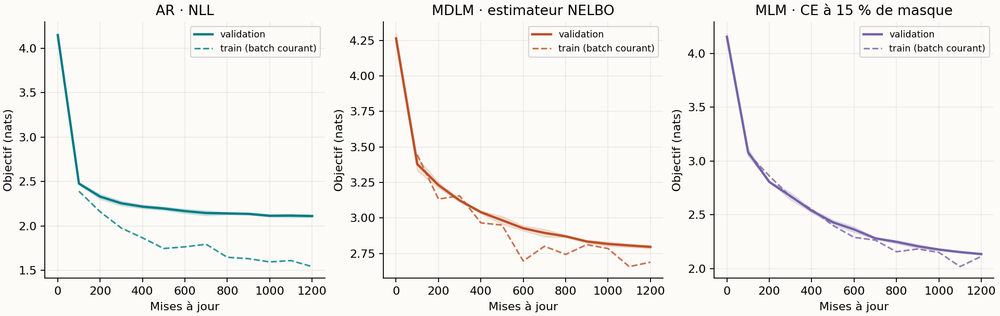
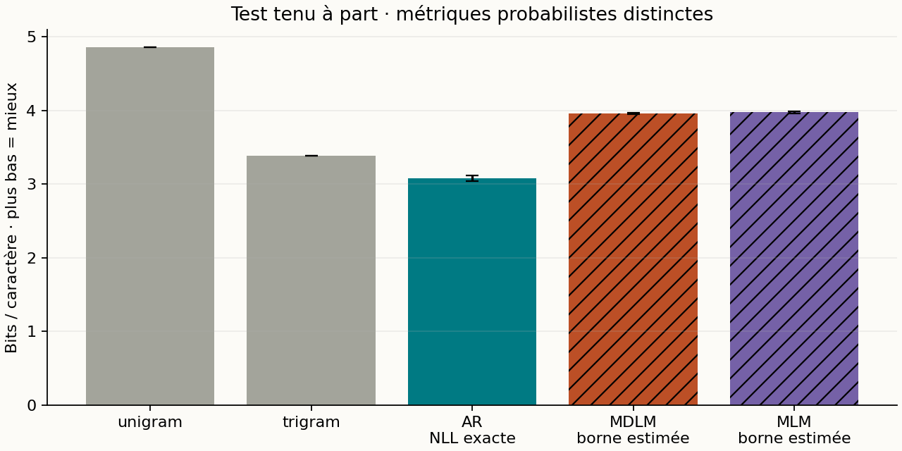
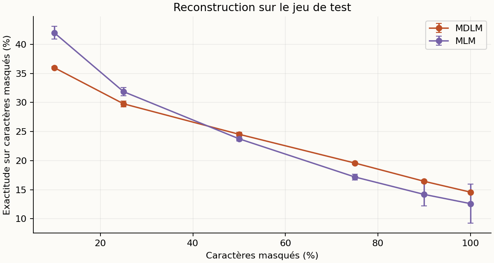
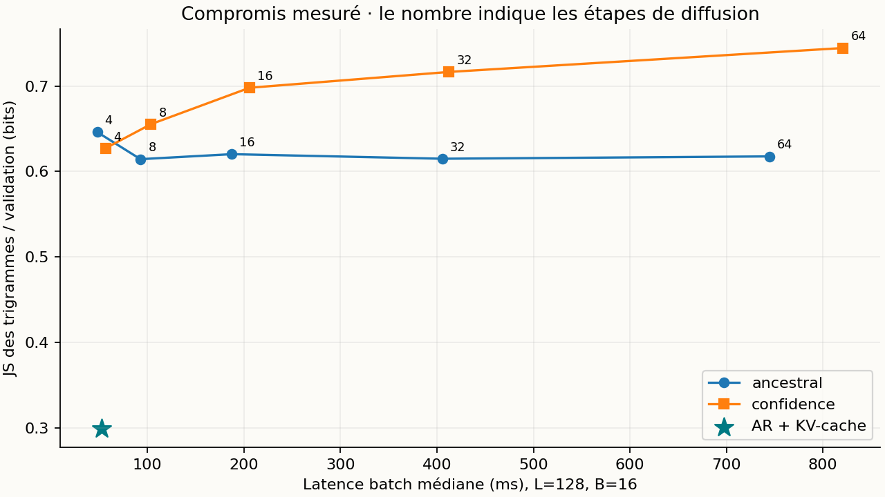
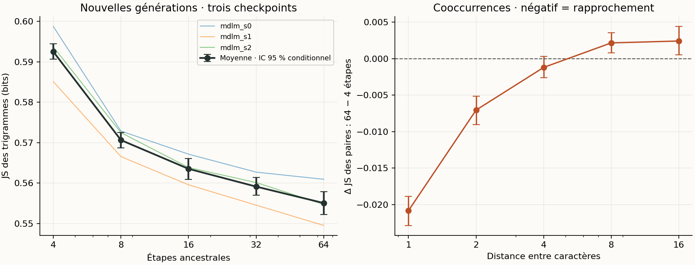

# Diffusion discrète en JAX : une étude reproductible à petit budget

Rapport expérimental · Tiny Shakespeare · entraînements et mesures locaux · 13 septembre 2026

Le projet implémente un MDLM à masque absorbant, un Transformer autorégressif avec KV-cache, un MLM et deux baselines statistiques. Chaque réseau possède 236,319 paramètres. Après 1200 mises à jour sur 200,000 caractères, le MDLM obtient une estimation de borne NELBO de 3.961 ± 0.011 bits/caractère sur le test ; l’autorégressif obtient une NLL exacte par bloc de 3.077 ± 0.036 bits/caractère. Ces deux nombres sont de nature différente. Les résultats démontrent un entraînement et un protocole de mesure fonctionnels ; ils ne démontrent pas une qualité linguistique de niveau LLM.

## 1. Hypothèses et périmètre

Trois questions guident cette expérience : un petit débruiteur apprend-il au-delà des fréquences marginales ? Comment les samplers probabiliste, aléatoire à quota et par confiance modifient-ils les générations ? La réduction des évaluations réseau produit-elle réellement un gain de latence face à un AR avec cache ? Les expériences principales utilisent trois graines lorsque la configuration le prévoit ; les ablations utilisent uniquement la graine 0.

Le suivi statistique de la section 6.1 étend le balayage du nombre d’étapes aux trois checkpoints MDLM, avec de nouvelles générations répétées. Il conserve l’entraînement existant et quantifie l’incertitude du sampling, sans prétendre mesurer celle de nouveaux entraînements.

Il s’agit d’une implémentation pédagogique du mécanisme MDLM/SUBS en temps discret fini, avec un backbone personnalisé. Ce n’est ni une reproduction des scores publiés de MDLM, ni LLaDA. Le projet ne comporte pas de distillation : les expériences en 4–64 étapes font varier le sampler du même checkpoint.

## 2. Données et protocole figé

| Élément | Valeur |
| --- | --- |
| Corpus | Tiny Shakespeare, char-rnn de Karpathy |
| SHA-256 | 86c4e6aa9db7c042ec79f339dcb96d42b0075e16b8fc2e86bf0ca57e2dc565ed |
| Découpage | 90 % / 5 % / 5 %, portions contiguës ; sous-ensemble préfixe pour le train |
| Caractères utilisés | {'train': 200000, 'val': 55770, 'test': 55770} |
| Caractères inconnus | {'train': 0, 'val': 0, 'test': 0} |
| Tokenisation | 62 caractères appris sur le train + UNK ; MASK, BOS et PAD seulement en entrée |
| Évaluation finale | 64 fenêtres disjointes de 128 caractères par split |
| Architecture | 2 blocs pre-norm, largeur 96, 4 têtes, MLP 4×, positions sinusoïdales |
| Prior de localité | True ; même biais de distance pour AR, MDLM et MLM |
| Optimisation | AdamW, LR 0.001, warmup 50, décroissance cosinus, clip norme 1, weight decay 0,01 sur matrices |
| Budget par modèle | 1200 × 16 × 128 = 2,457,600 caractères présentés |
| Graines | [0, 1, 2] |
| Plateforme | macOS-15.1-arm64-arm-64bit-Mach-O |
| Versions | Python 3.13.3 ; JAX 0.4.38 ; NumPy 2.4.2 |
| Backend observé | TFRT_CPU_0 |

Le bundle de référence a été produit sur Apple M1, 8 Go de mémoire, 8 cœurs logiques, avec JAX CPU après échec de Metal. Le backend effectif de cette expérience figure dans le tableau ci-dessus. Les fenêtres ne traversent jamais les limites de split. Le jeu de test intervient après le choix d’architecture sur validation ; le choix des samplers exploratoires est étudié sur validation. Les évaluations portent sur des fenêtres échantillonnées, pas sur l’intégralité du corpus de test.

Le nombre de paramètres, le budget de caractères présentés et l’optimiseur sont identiques entre réseaux. Cela n’égalise pas le nombre de cibles supervisées : AR prédit chaque caractère, MDLM seulement ceux masqués, MLM environ 15 %. Aucun réglage extensif propre à chaque famille n’a été effectué. Les résultats à longueur 256 extrapolent un entraînement à longueur 128.

## 3. Objectif et génération

On note mₖ la probabilité de masque au pas k, avec m₀ = 0 et mT = 1. La corruption conserve chaque caractère avec probabilité 1 − mₖ et le masque sinon. Le débruiteur bidirectionnel prédit une distribution sur les caractères ordinaires et UNK. MASK, BOS et PAD sont exclus de sa sortie. Le backbone choisi ne reçoit pas explicitement le temps.

```text
k ~ Uniforme{1,…,T}, z ~ q(z | x, k)
L̂ = [T × (mₖ − mₖ₋₁) / mₖ] × (1/L) Σᵢ 1[zᵢ = MASK] × CEᵢ
p(révéler un token entre t et s | encore masqué) = (mₜ − mₛ) / mₜ
```

La normalisation porte sur tous les caractères valides, pas sur le nombre aléatoire de masques. Avec T = 64, cet estimateur est non biaisé pour la NELBO de la chaîne finie. Le premier terme inclut la reconstruction finale ; le prior terminal tout masqué a une KL nulle. Les points temporels d’un batch sont stratifiés. L’évaluation somme tous les pas avec 2 répétitions de corruption par fenêtre et par pas. La borne existe en espérance : une estimation Monte Carlo n’est pas une borne certifiée pour chaque tirage.

Le sampler ancestral respecte la transition ci-dessus et conserve les tokens déjà révélés. Les samplers aléatoire à quota et par confiance imposent le nombre de révélations ; celui par confiance classe la probabilité du token candidat échantillonné. Ce sont des heuristiques : leur distribution de sortie n’a pas la vraisemblance mesurée par la NELBO ancestrale. Le MLM utilise 15 % de masquage et une CE moyenne sur positions masquées. L’ablation unweighted supprime le poids temporel tout en gardant la normalisation par longueur.

## 4. Vérifications mathématiques et logicielles

51 tests exécutés : {'passed': 51, 'failed': 0, 'error': 0, 'skipped': 0}. Durée mesurée : 15.4 s. Les empreintes SHA-256 des sources testées sont enregistrées dans results/tests.json.

Les tests couvrent les bornes et fréquences de corruption, les pertes sur tokens masqués et valides, les gradients finis, l’absence de fuite du futur dans AR, l’utilisation du contexte droit en diffusion, l’équivalence des logits avec et sans KV-cache, la conservation du contexte observé, la monotonie du démasquage et l’absence de masque final. Un modèle probabiliste à deux caractères est énuméré exactement pour vérifier que la NELBO borne la NLL ; un autre test retrouve log(V) pour un débruiteur uniforme, quel que soit le calendrier.

Les tests d’intégration incluent un surapprentissage déterministe tout masqué, la sauvegarde/relecture sans pickle et une étape de reprise strictement identique (paramètres, moments Adam, compteur et PRNG). Un scénario smoke exécute aussi la chaîne complète. La reproductibilité bit à bit concerne ce backend et ces versions ; les GPU et les autres plateformes ne sont pas validés.

## 5. Apprentissage et résultats tenus à part



| Modèle | Mesure | Test, bits/caractère | Exécution entraînement, s | Première compilation + pas, s |
| --- | --- | --- | --- | --- |
| unigram | NLL exacte | 4.855 | — | — |
| trigram | NLL exacte | 3.386 | — | — |
| AR | NLL exacte | 3.077 ± 0.036 | 81.9 ± 2.1 | 1.5 ± 0.3 |
| MDLM | NELBO estimée | 3.961 ± 0.011 | 84.4 ± 23.6 | 1.5 ± 0.4 |
| MLM | NELBO estimée | 3.975 ± 0.014 | 63.0 ± 15.6 | 1.2 ± 0.4 |

Les ± sont des écarts-types entre graines, et non des intervalles de confiance. Les erreurs standard entre fenêtres et les répétitions Monte Carlo sont dans les JSON. La colonne entraînement mesure les pas JAX synchronisés, hors chargement, évaluation et sauvegarde ; certains essais exploratoires ont partagé le CPU, donc ces temps ne constituent pas un benchmark d’entraînement isolé. Les mesures d’inférence ci-dessous sont isolées.



L’écart entre la NLL unigramme et la NELBO estimée MDLM est de 0.895 bits/caractère. Une baisse sous la baseline marginale fournit un signal d’apprentissage des dépendances. La performance textuelle doit cependant être jugée avec les échantillons ; la réduction d’une loss ne suffit pas à établir une bonne génération.



| Générations / référence test | JS3 | Distinct-3 | Répétition 4-grammes | Copies 32-car. |
| --- | --- | --- | --- | --- |
| AR | 0.307 ± 0.007 | 0.451 ± 0.011 | 0.022 ± 0.006 | 0.000 ± 0.000 |
| MDLM | 0.611 ± 0.006 | 0.695 ± 0.013 | 0.001 ± 0.001 | 0.000 ± 0.000 |
| MLM | 0.643 ± 0.036 | 0.251 ± 0.037 | 0.083 ± 0.044 | 0.000 ± 0.000 |

AR utilise son sampler causal ; MDLM utilise 16 pas ancestraux, MLM 16 pas par confiance. Température 1 et aucun top-k. Les statistiques décrivent donc des combinaisons modèle/sampler explicites, et non un effet isolé de la seule loss.

## 6. Benchmarks de latence et mémoire

Chaque couple modèle/sampler/forme tourne dans un processus Python neuf. Dans l’étude principale livrée, les mesures démarrent après la fin des entraînements. La compilation est séparée ; une exécution de chauffe est exclue, puis 5 répétitions sont synchronisées avec block_until_ready. La génération AR utilise réellement un KV-cache, vérifié contre le calcul causal complet. Les mesures incluent échantillonnage et calcul réseau ; elles excluent conversion en texte et transfert des sorties vers NumPy.

| L / batch | AR + cache, ms | MDLM 4 pas, ms | MDLM 8 pas, ms | MDLM 16 pas, ms | MDLM 32 pas, ms | MDLM 64 pas, ms |
| --- | --- | --- | --- | --- | --- | --- |
| 64 / 1 | 1.91 | 2.68 | 5.37 | 10.15 | 19.58 | 40.03 |
| 128 / 1 | 4.74 | 5.04 | 10.82 | 18.44 | 36.85 | 73.46 |
| 128 / 16 | 52.80 | 47.85 | 92.72 | 187.38 | 405.55 | 744.42 |
| 256 / 16 | 154.94 | 145.83 | 243.05 | 488.42 | 982.48 | 2010.62 |

Pour L=128, batch=16, AR prend 52.80 ms et MDLM ancestral à 4 pas 47.85 ms, soit un rapport de latence AR/MDLM de 1.10. Un rapport supérieur à 1 indique ici une génération MDLM plus rapide ; il ne signifie pas une qualité identique.

| L / batch | Sampler | Caractères/s | Pic RSS, MiB | Buffers temporaires compilés, MiB |
| --- | --- | --- | --- | --- |
| 64 / 1 | AR (64 pas) | 33,515 | 240.8 | 0.12 |
| 64 / 1 | MDLM (16 pas) | 6,303 | 242.3 | 0.39 |
| 128 / 1 | AR (128 pas) | 27,004 | 237.0 | 0.24 |
| 128 / 1 | MDLM (16 pas) | 6,940 | 243.1 | 1.09 |
| 128 / 16 | AR (128 pas) | 38,789 | 252.1 | 3.81 |
| 128 / 16 | MDLM (16 pas) | 10,930 | 276.6 | 12.92 |
| 256 / 16 | AR (256 pas) | 26,436 | 261.3 | 7.60 |
| 256 / 16 | MDLM (16 pas) | 8,386 | 365.2 | 42.59 |

Le débit, les quantiles 10/90 %, les durées brutes, le temps de compilation et la mémoire sont disponibles dans timings.csv/json. La mémoire mesurée est le pic RSS du processus CPU isolé, qui inclut Python, JAX et la compilation ; elle n’est ni une mesure de VRAM ni un pic strictement limité à l’inférence. Les tailles de buffers compilés sont également enregistrées. Une passe MDLM traite toute la séquence ; une passe AR avec cache traite un nouveau token.



### 6.1 Effet du nombre d’étapes : générations répétées

Le premier balayage ne comportait que 32 textes par réglage. Pour vérifier si son écart entre 4 et 64 étapes dépasse la variabilité du tirage, nous avons généré 7,680 nouveaux textes : 3 checkpoints existants × 5 nombres d’étapes × 8 répétitions × 64 séquences de 128 caractères. Température 1, aucun top-k, sampler ancestral inchangé. Les répétitions sont appariées par clé aléatoire entre nombres d’étapes ; les clés diffèrent entre répétitions et checkpoints.

La référence est fixe : 400 fenêtres disjointes de validation (51,200 caractères). Le critère principal est la variation de JS des trigrammes entre 64 et 4 étapes. Ce suivi reste exploratoire : cette comparaison a été choisie après le premier balayage, puis son protocole a été figé avant les nouvelles générations. Les valeurs de JS empiriques dépendent du nombre de textes et ne se comparent pas directement aux valeurs du balayage à 32 textes.



| Étapes | JS3 moyenne | IC 95 % conditionnel | JS unigrammes moyenne |
| --- | --- | --- | --- |
| 4 | 0.5925 | [0.5906 ; 0.5944] | 0.0095 |
| 8 | 0.5706 | [0.5687 ; 0.5725] | 0.0092 |
| 16 | 0.5635 | [0.5609 ; 0.5661] | 0.0091 |
| 32 | 0.5591 | [0.5570 ; 0.5614] | 0.0092 |
| 64 | 0.5551 | [0.5522 ; 0.5579] | 0.0096 |

Le contraste moyen JS3(64) − JS3(4) vaut -0.0374 bit (IC 95 % [-0.0404 ; -0.0342]). 24 paires donnent une diminution, 0 une augmentation et 0 une égalité. Le test exact bilatéral des signes donne p = 1.19e-07. L’intervalle entièrement négatif indique un rapprochement des statistiques locales avec davantage d’étapes, dans ce dispositif. Cela ne démontre ni une bonne qualité linguistique, ni une reproduction de la perplexité du papier.

Les intervalles utilisent 10 000 rééchantillonnages de lots entiers, séparément dans chaque checkpoint, et non des caractères supposés indépendants. Le test des signes suppose, sous l’hypothèse nulle, des signes équiprobables et indépendants entre paires. Ni le bootstrap ni ce test ne mesurent l’incertitude sur de nouveaux entraînements : les trois checkpoints sont conditionnés, pas traités comme 24 modèles indépendants. Les diagnostics de paires sont secondaires, avec intervalles ponctuels sans correction pour comparaisons multiples.

Le profil spatial nuance ce gain : la JS des paires voisines diminue de -0.0208, alors qu’à distance 16 elle augmente de +0.0024. Le contraste sur les unigrammes est proche de zéro (+0.00002, IC 95 % [-0.00055 ; +0.00055]). Ces diagnostics exploratoires suggèrent un bénéfice concentré sur les arrangements locaux, pas une amélioration uniforme à toutes les distances. Ils ne permettent pas d’affirmer l’égalité des marginales ni l’apprentissage de dépendances longues ; le biais architectural de localité et le faible budget d’entraînement restent des limites de cette interprétation.

À chaque transition ancestrale, les nouveaux caractères sont tirés indépendamment conditionnellement au texte visible, puis ne sont plus modifiés. Changer le nombre d’étapes modifie donc le contexte disponible lors de ces décisions. La mesure des cooccurrences examine l’effet statistique de ce changement ; elle reste sensible aux fréquences marginales et n’isole pas, à elle seule, une perte de dépendances. Les checkpoints étant identiques entre réglages, le contraste mesure un effet du sampling à entraînement fixé, pas un effet d’apprentissage ni un mécanisme causal identifié.

[Protocole figé, sources et checkpoints identifiés](sampling_statistics/protocol.json)

[Mesures des 120 lots de génération](sampling_statistics/batch_metrics.json)

[Contrastes, intervalles et empreintes des générations](sampling_statistics/summary.json)

## 7. Ablations

| Entraînement, graine 0 | NELBO validation | NELBO test |
| --- | --- | --- |
| mdlm_s0 | 3.946 | 3.950 |
| mdlm_cosine_s0 | 3.930 | 3.945 |
| mdlm_log_s0 | 4.079 | 4.075 |
| unweighted_s0 | 3.858 | 3.865 |

À la graine 0, retirer les poids donne 3.865 bits/caractère contre 3.950 avec la loss MDLM. L’ablation non pondérée obtient donc le meilleur score des deux dans cet essai. Le critère mesuré reste la même NELBO linéaire ; seul l’objectif d’entraînement change. Une hypothèse à tester est l’effet de la variance des gradients et de la répartition des efforts entre taux de masque, avec ce budget court et un même taux d’apprentissage. Cette expérience seule ne tranche pas entre ces explications.

Les calendriers de masquage sont m(t)=t, sin²(πt/2) et log(1+9t)/log(10), tous avec les poids discrets correspondants. Changer le calendrier d’entraînement et changer la grille du sampler sont deux expériences distinctes. Les ablations enregistrées couvrent aussi le quota aléatoire, la confiance, les pas 4/8/16/32/64, la température 0 et 0,7 ainsi que top-k=5. Une graine par ablation ne permet pas d’affirmer une supériorité robuste.

| Sampler | Grille | Temp. | top-k | JS3 val. | Répétition 4-grammes | Copies 32-car. |
| --- | --- | --- | --- | --- | --- | --- |
| ancestral | linear | 1.0 | 0 | 0.620 | 0.001 | 0.000 |
| random | linear | 1.0 | 0 | 0.607 | 0.002 | 0.000 |
| confidence | linear | 1.0 | 0 | 0.698 | 0.165 | 0.000 |
| ancestral | cosine | 1.0 | 0 | 0.622 | 0.002 | 0.000 |
| ancestral | log | 1.0 | 0 | 0.642 | 0.003 | 0.000 |
| confidence | linear | 0.0 | 0 | 0.934 | 0.448 | 0.000 |
| confidence | linear | 0.7 | 0 | 0.724 | 0.198 | 0.000 |
| confidence | linear | 1.0 | 5 | 0.750 | 0.226 | 0.000 |

Les statistiques de génération portent sur 32 séquences de 128 caractères par cas. Distinct-1/2/3, répétitions, JS des n-grammes, copies intégrales et copies de fenêtres de 32 caractères sont enregistrés. Distinct est dépendant de la taille d’échantillon et peut favoriser du bruit. Une absence de copie détectée n’est pas une preuve d’absence de mémorisation.

## 8. Échantillons bruts et infilling

Les exemples suivants sont systématiquement le premier échantillon sauvegardé de la graine 0, à température 1, sans top-k. Ils ne sont pas sélectionnés pour leur qualité.

### ar_s0

```text
o se him anscide for it
God yet, what's vantured lown say?

VOLUMNIA:
O, sir, Cairenze.

MENENIUS:
Si! Then true good chard to
T
```

### mdlm_s0

```text
h senthcatheiint?
Wa
Th eg'hto ehtss tomn td ,odoTG

,htet soh ,enos cehtal at Foubtelal den:
ONIOUG rits ot enocn,it ;e
ANi tim
```

### mlm_s0

```text
 uoht tot neh  ouse eht ot ta  ton heee a theno  oI  foeh tt ot ao tnoh e!c eh er otneh to ted oo of ,wot teh to ot none eht I t
```

Infilling : tiers central masqué, exactitude de caractères = 8.07 %, contexte préservé = True. Cette mesure ne juge pas la plausibilité des alternatives. Aucune supériorité sur AR en contexte bidirectionnel n’est revendiquée.

La baseline qui remplit tout le trou avec le caractère le plus fréquent du train obtient 14.24 %. Le sampler greedy par confiance est ici moins bon que cette baseline : cet échec fait partie des résultats, malgré la baisse de NELBO.

```text
Entrée
ua.
Do you hear, sir? To leave frivolous c███████████████████████████████████████████ntio that his father is
come from Pisa, and

Sortie
ua.
Do you hear, sir? To leave frivolous co  ton uon oht ton tor oouro  ton tot  oo  ntio that his father is
come from Pisa, and

Référence
ua.
Do you hear, sir? To leave frivolous circumstances,
I pray you, tell Signior Lucentio that his father is
come from Pisa, and
```

## 9. Exploration sur validation et limites

| Pilote MDLM graine 0 | Mises à jour | Objectif validation, nats |
| --- | --- | --- |
| Sinusoïdes amplitude 1, sans prior | 1200 | 3.337 |
| Amplitude 0,1, sans prior | 1200 | 3.137 |
| Amplitude 0,1 + prior local | 1200 | 2.788 |

La sélection du prior local s’appuie sur ces pilotes de validation, avant l’évaluation du test. Le prior a ensuite été appliqué à toutes les familles de réseaux. Il constitue un choix architectural réel, à documenter lors d’une présentation. Ce petit corpus et ce petit budget ne permettent pas d’extrapoler aux modèles à milliards de paramètres, au raisonnement, à la créativité ou à l’alignement RLHF. Les résultats à 256 caractères nécessitent une étude de qualité dédiée. Le choix final du checkpoint est le dernier pas prévu, sans sélection sur le test.

## 10. Reproduction

```text
python3 -m venv .venv
.venv/bin/pip install -r requirements.txt
JAX_PLATFORMS=cpu .venv/bin/python check.py
JAX_PLATFORMS=cpu .venv/bin/python run.py all --config configs/study.json --output results/study
# Smoke complet :
JAX_PLATFORMS=cpu .venv/bin/python run.py all --config configs/smoke.json --output results/smoke
# Démonstration à partir du checkpoint déjà livré :
JAX_PLATFORMS=cpu .venv/bin/python demo.py --steps 16 --seed 42
```

Les checkpoints contiennent paramètres, états Adam, PRNG, compteur, configuration et historique. Relancer train avec le même dossier et la même configuration reprend un entraînement interrompu ; changer la configuration provoque une erreur. Les actions train, evaluate, benchmark et report peuvent être exécutées séparément. Une reproduction sur un autre matériel doit conserver les versions et publier ses propres temps. Les dépendances GPU éventuelles ne sont pas installées ici.

## 11. Références indépendantes, audit et contrainte de calcul

Audit du 13 septembre 2026 : revue des articles, inspection statique de quatre dépôts à révision figée, vérification des métadonnées de poids et des liens. Aucun modèle tiers n’a été entraîné, chargé ou évalué ici. La recherche n’est pas exhaustive. Une équipe indépendante peut réutiliser le code des auteurs : indépendance de l’équipe et indépendance de toute l’implémentation ne sont pas équivalentes.

### 11.1 Référence chiffrée : la baseline MDLM de VADD

Xie et al., VADD (ICLR 2026), équipe distincte de Sahoo et al., rapportent dans leur tableau 8 une perplexité MDLM de 23,07 sur OpenWebText, contre 23,21 pour la configuration publiée qu’ils citent (écart relatif : −0,60 %). Le protocole annonce un million de mises à jour, batch 512 et contexte 1 024. Ce sont des résultats tiers, pas nos mesures ; leur concordance ne valide pas automatiquement notre code ni toutes les expériences MDLM.

[VADD v2 — tableau 8 et protocole](https://arxiv.org/html/2505.17384v2)

Le dépôt VADD existe, mais l’audit relève des configurations de données absentes, aucun script dédié à la baseline MDLM, et aucun checkpoint ou log numérique identifié pour celle-ci. Nous le retenons comme référence bibliographique, pas comme baseline directement reproductible en l’état.

[VADD — version inspectée](https://github.com/tyuxie/VADD/tree/6bd9dded67c3034e6f9a3a77190feb5c92678eaa)

[Absence des configurations : signalement public concordant](https://github.com/tyuxie/VADD/issues/1)

### 11.2 Candidat logiciel plus documenté : MDLM standard dans MDM-Prime

Le dépôt de Chao et al. fournit une branche MDLM standard (prime.target_length=1), les configurations OWT et un graphique de reproduction. L’inspection statique retrouve SUBS et la pondération temporelle. Un checkpoint de 2,72 Go est inventorié sur Hugging Face ; nous avons retrouvé son chemin après une erreur dans le lien du README. Les séries W&B brutes et la correspondance exacte entre poids et courbe restent non vérifiées. Ce candidat est plus documenté, mais n’est pas certifié ni exécuté dans notre étude.

[MDM-Prime — code et documentation inspectés](https://github.com/chen-hao-chao/mdm-prime/tree/a4a5806a6f5211f1d94b68a12b379de1c3e318fd/text)

[Checkpoint MDLM identifié — révision HF figée, non téléchargé](https://huggingface.co/chen-hao-chao/mdm-prime/blob/9facb1b46ef132dccbd5f46a7ec987fe399e140a/text/owt/results_mdm_l1_owt_reproduce/checkpoint.ckpt)

Attention : l’erratum des auteurs invalide d’anciennes évaluations de perplexité des variantes Prime/EDLM. Ces résultats ne servent donc pas de preuve ici. La note distingue le MDLM standard à sorties conditionnellement factorisées ; cette distinction ne dispense pas de vérifier numériquement la branche et le checkpoint retenus.

[Erratum — portée et corrections](https://chen-hao-chao.github.io/dependency-breaks-validity/)

### 11.3 Autres candidats et absence du pont vers notre dataset

| Candidat examiné | Éléments disponibles | Limite pour notre chaîne de validation |
| --- | --- | --- |
| LoMDM | Scripts MDLM sur OWT et LM1B | Pas de checkpoint de baseline identifié dans le README ; pas de Tiny Shakespeare identifié. |
| nathanrs/tiny-diffusion | Code Tiny Shakespeare et poids annoncés | CE normalisée par les masques du batch, sans poids inverse par séquence : objectif différent du nôtre ; pas de reproduction OWT/LM1B identifiée. |
| ashishk1331/MDLM-TinyShakespeare | Fiche, notebook et poids publiés | Fiche incomplète ; notebook et poids non audités ici ; pas de validation sur les benchmarks originaux identifiée. |

[LoMDM — version inspectée](https://github.com/chunsanHong/LoMDM/tree/fa6fb0f3fc63321558ee9b7c736fa6014de50834)

[tiny-diffusion — calcul de loss inspecté](https://github.com/nathanrs/tiny-diffusion/blob/667853bc829192637ef932692f32aa82b6f09b5a/diffusion.py#L225-L228)

[MDLM-TinyShakespeare — fiche consultée](https://huggingface.co/ashishk1331/MDLM-TinyShakespeare)

Nous n’avons pas identifié une même implémentation disposant à la fois d’une reproduction vérifiable des benchmarks MDLM originaux et de résultats directement comparables sur notre sous-ensemble Tiny Shakespeare ou notre test de copie binaire. La chaîne « papier → référence indépendante → notre JAX » demeure incomplète. Partager le nom d’un corpus ne garantit ni le même découpage, ni la même tokenisation, ni le même objectif.

### 11.4 Pourquoi une étude réduite, et ce que nous pouvons affirmer

Notre budget disponible est celui d’un Apple M1 avec 8 Go de mémoire, JAX CPU, sans ressource CUDA allouée. Il a motivé le choix de notre implémentation nano JAX : 236 319 paramètres, 1 200 mises à jour, contexte de 128 caractères et 200 000 caractères de train. Cela ne permet pas de refaire rapidement l’entraînement OWT à l’échelle publiée. Les caractères de notre étude et les tokens GPT-2 ne sont pas des unités identiques ; nous ne présentons pas leur ratio comme un ratio de calcul.

Faute du budget nécessaire à une reproduction à l’échelle originale, nous utilisons les résultats indépendants publiés comme références documentaires et évaluons localement une version réduite. Nous n’avons pas utilisé VADD ou MDM-Prime pour produire nos courbes. Le manque de calcul explique cette réduction de périmètre, mais ne prouve pas que notre implémentation est équivalente et ne rend aucun dépôt tiers obligatoire.

La prochaine comparaison probante nécessiterait de confirmer le couple code/checkpoint et le résultat OWT de la référence, puis d’exécuter sa branche MDLM sur le petit dataset. Il faudrait aligner architecture, données et splits, normalisation de loss, temps continu ou discret, budget, EMA et métriques ; vérifier logits, loss et gradients sur des entrées identiques avant de comparer plusieurs courbes d’apprentissage. Ce protocole est proposé, pas réalisé. Les résultats externes ne sont pas superposés aux nôtres comme s’ils mesuraient la même expérience.

[Relevé d’audit : révisions, constats et métadonnées de poids](../../references/independent_audit.json)

[Vérifications statiques et empreintes des sources tierces](../../references/source_checks.json)

## Références et données

[MDLM — article et dérivation du processus SUBS](https://arxiv.org/abs/2406.07524)

[Implémentation de référence des auteurs, non copiée dans ce projet](https://github.com/kuleshov-group/mdlm)

[Tiny Shakespeare — source du corpus](https://github.com/karpathy/char-rnn/blob/master/data/tinyshakespeare/input.txt)

[JAX — compilation, exécution asynchrone et benchmarks](https://docs.jax.dev/en/latest/benchmarking.html)

[Résultats comparatifs CSV](model_metrics.csv)

[Mesures de latence et mémoire CSV](timings.csv)

[Ablations de génération CSV](sampling_ablations.csv)

[Preuve d’exécution des tests](../tests.json)
